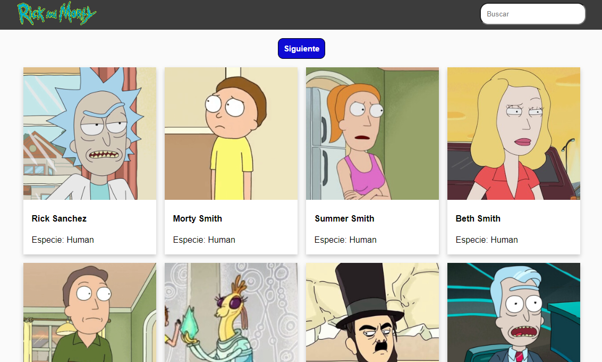

# Página Web de Rick and Morty

Este proyecto es una aplicación web construida con React que muestra información sobre los personajes de la serie animada "Rick and Morty". La información es obtenida de la API pública de Rick and Morty. Los usuarios pueden buscar personajes, ver detalles específicos de cada personaje, y explorar episodios y ubicaciones.

## Captura de Pantalla



## Características

- **Listado de personajes:** Muestra una lista de personajes con su imagen, nombre y estado.
- **Búsqueda de personajes:** Permite buscar personajes por nombre.
- **Detalles del personaje:** Al seleccionar un personaje, se muestra información detallada, incluyendo la especie, género, origen, y episodios en los que aparece.
- **Filtrado y paginación:** Los usuarios pueden filtrar personajes por estado (vivo, muerto, desconocido) y navegar a través de múltiples páginas de resultados.

## Instalación

1. **Clonar el repositorio:**

   ```bash
   git clone https://github.com/tu-usuario/nombre-del-repositorio.git

## Tecnologías Utilizadas

- **React:** Biblioteca principal para la construcción de la interfaz de usuario.
- **Axios:** Para realizar solicitudes HTTP a la API pública.

